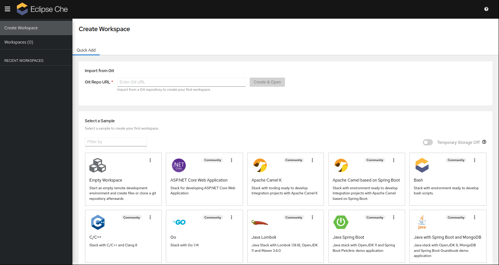

# Eclipse Che on Kubernetes

All resources to instanciate Eclipse Che on your own (_kubeadm-installed_ or similar) Kubernetes cluster.

Read the Medium article : ["Developing in the Cloud"](https://medium.com/@flavienb/developing-in-the-cloud-5cfc9b2236ef).

## Architecture and pre-requisites


Eclipse Che [requires an OIDC identity provider](https://github.com/eclipse/che/issues/21160#issuecomment-1038877280) configured in your Kubernetes cluster in order to work. We will use [Keycloak](https://github.com/keycloak/keycloak) in this repo. All external flows will be routed by an [Ingress Controller](https://kubernetes.io/docs/concepts/services-networking/ingress-controllers/) deployed in our Kubernetes cluster.

Keycloak must be run in an external environment in order to be reachable by our Kubernetes' API server at startup. A dedicated role and rolebinding will be created in our cluster.

It is recommended to setup Che on a dedicated machine (VM or baremetal) due to its heavy requirements.

## Getting started

At this step, I expect you to have :

- A working Kubernetes cluster up and running 
- An [Ingress Controller](https://kubernetes.github.io/ingress-nginx/deploy/) installed on your cluster
- [Certmanager](https://cert-manager.io/docs/installation/) installed on your cluster
- A storage class such as [OpenEBS](https://openebs.io/docs/user-guides/installation) installed on your cluster
- Docker installed on the same machine (or a remote host, as long as you edit the following configurations)

To help you setup your standalone Kubernetes with kubeadm, use scripts in `./helpers`.

### A. Setup Keycloak

1. Install dependencies

    - jq
    - docker
    - docker-compose

2. **Copy** env variables

    ```bash
    cp ./keycloak/.env.example ./keycloak/.env
    ```

    Correctly set `KEYCLOAK_EXTERNAL_URL` in your `.env` file replacing `xxx.xxx.xxx.xxx` with your cluster **IP address**. Then run :

    ```bash
    export $(grep -v '^#' ./keycloak/.env | xargs)
    ```

3. **Generate** certs and start Keycloak

    ```bash
    cd keycloak

    bash ./generate-certs.sh
    docker-compose up -d
    ```

4. **Create** and configure the `apacheche` client in Keycloak

    ```bash
    bash ./configure-keycloak.sh
    
    cd ..
    kubectl create ns test-ns
    kubectl apply -f ./rbac.yaml
    ```

    > `KEYCLOAK_ADMIN_USER` will get attributed the "admin" role to play inside Che. A "developer" role can be assigned as well but has no RBAC configured related to Che : they only have access to namespace `test-ns`.

### B. Bind Kubernetes to use Keycloak as OIDC provider

1. Copy Keycloak's certificate to your system keystore

    ```bash
    sudo cp ./keycloak/certs/ca/root-ca.pem /etc/ca-certificates/keycloak-ca.pem
    ```

    This certificate file must be reachable by your Kubernetes cluster.

2. Add the following configuration to `/etc/kubernetes/manifests/kube-apiserver.yaml`

    Please **replace** `KEYCLOAK_EXTERNAL_URL` !

    ```txt
        - --oidc-issuer-url=$KEYCLOAK_EXTERNAL_URL/realms/master
        - --oidc-client-id=kubernetes
        - --oidc-username-claim=email
        - --oidc-groups-prefix='keycloak:'
        - --oidc-groups-claim=groups
        - --oidc-ca-file=/etc/ca-certificates/keycloak-ca.pem
    ```

    :hourglass_flowing_sand: Please wait at least 1 minute and check that the cluster is still working running `kubectl get po -A`

3. Make Keycloak accessible through your Ingress Controller

    ```bash
    kubectl create secret tls tls-keycloak-ingress --cert ./keycloak/certs/keycloak/keycloak.pem --key ./keycloak/certs/keycloak/keycloak.key

    sed "s|\$KEYCLOAK_EXTERNAL_URL|${KEYCLOAK_EXTERNAL_URL#https://}|g" ingress-keycloak-example.yaml > ingress-keycloak.yaml
    sed -i "s|\$CHE_EXTERNAL_URL|${CHE_EXTERNAL_URL#https://}|g" ingress-keycloak.yaml
    kubectl apply -f ./ingress-keycloak.yaml
    ```

### C. Install Eclipse Che

1. Install the chectl command line

    ```bash
    bash <(curl -sL  https://www.eclipse.org/che/chectl/)
    ```

2. Configure Keycloak certificates for Che

    ```bash
    kubectl create namespace eclipse-che
    kubectl create configmap keycloak-certs \
        --from-file=keycloak-ca.crt=./keycloak/certs/keycloak/tls.crt \
        -n eclipse-che
    kubectl label configmap keycloak-certs \
        app.kubernetes.io/part-of=che.eclipse.org \
        app.kubernetes.io/component=ca-bundle \
        -n eclipse-che
    ```

3. Generate the config file and run the install

    ```bash
    cp che-patch-example.yaml che-patch.yaml
    sed -i "s|\$KEYCLOAK_CHE_CLIENT_SECRET|${KEYCLOAK_CHE_CLIENT_SECRET}|g" che-patch.yaml
    sed -i "s|\$KEYCLOAK_CHE_CLIENT_ID|${KEYCLOAK_CHE_CLIENT_ID}|g" che-patch.yaml
    sed -i "s|\$KEYCLOAK_EXTERNAL_URL|${KEYCLOAK_EXTERNAL_URL}|g" che-patch.yaml
    sed -i "s|\$CHE_EXTERNAL_URL|${CHE_EXTERNAL_URL}|g" che-patch.yaml

    chectl server:deploy --domain=${CHE_EXTERNAL_URL#*://} --platform=k8s --che-operator-cr-patch-yaml=./che-patch.yaml --telemetry=off --skip-cert-manager
    ```

    :information_source: Make sure you have a default _storage class_ installed on your cluster.

    > If something goes wrong, you can uninstall Che using the following commands :
    > 
    > ```bash
    > chectl server:delete --delete-all --delete-namespace
    > ```
    >
    > Run again commands from step 2.

4. Connect to `CHE_EXTERNAL_URL` !

    
